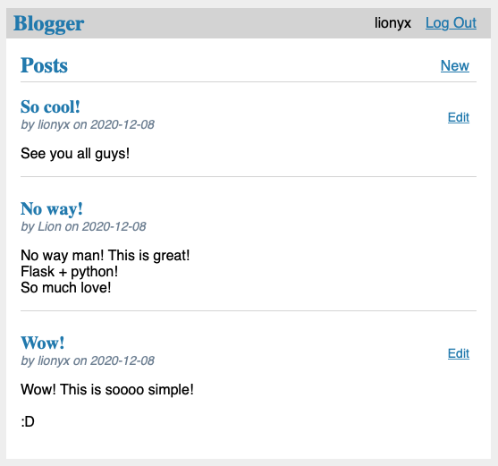

# Blogger

A really simple blog web application written in Python with Flask.

## Install:
- Create a new virtualenv
- Download blogger-1.0.0-py3-none-any.whl found on the dist/ folder
- Run: 
`$ pip install blogger-1.0.0-py3-none-any.whl`
`$ export FLASK_APP=blogger`
`$ flask init-db`
- For testing, just run:
`
$ flask run
`
And use a web browser to access the URL provided
- For production, change the SECRET_KEY under config.py to something secure and deploy it using a WSGI server, such as:
`
$ pip install waitress
$ waitress-serve --call 'blogger:create_app'
`

## Tests:
You may find test routines under the test/ directory.

Coverage was used to produce a html report of the tests applied that might be found under htmlcov/ directory.

## Screenshots

